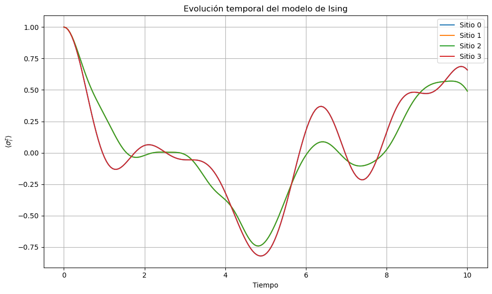

# Resultados

A continuación se presenta la evolución temporal de los valores esperados ⟨σᶻ⟩ para cada sitio del modelo de Ising cuántico unidimensional:

 

Como se puede observar, el comportamiento de los espines varía en el tiempo debido a la dinámica cuántica gobernada por el Hamiltoniano total del sistema.
 
